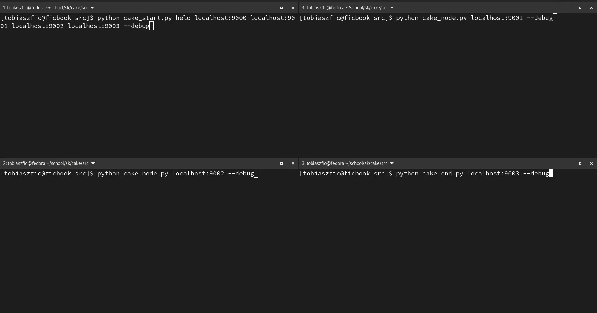

# Cake Router
A program which is supposed to work akin to TOR, but entirely unencrypted in the simplest way possible.

# Working Principle
The program consists of three modules: a start node, an intermediate node and an end node. A system can consist of at least one start node, one end node and one or more intermediate node(s).
The working principle is as follows:

- start node: 
    - binds to an address 
    - assembles a 'cake': \<address of start node\>;\<addresses of nodes AFTER the one being sent the message>;\<message>
    - sends the 'cake' to the next node
    - starts waiting for ack
- intermediate node:
    - takes two first addresses off the cake: saves the first one as a return address and the second one as the next address to send the rest of the cake to
    - prepends the cake with its own address
    - sends it to the next node (this process can be done many times)
    - starts waiting for ack (when an ack is sent from the next node, it will send it back to the return address it got from the beginning of the cake)
- end node:
    - takes off the last address and interprets it as the return address
    - prints the message
    - sends an ack to the return address

Notice: once we read the third node, the node is not aware of where the message originally came from. It only knows the adresses of the node before it and of the nodes after it. In principle, this is how TOR works (though of course with many layers of encryption in between).

# How to use it
The program is developed entirely in vanilla python, using only `argparse`, `socket` and Python's regex (`re`) modules. To use, simply launch nodes on different terminals:

- cake_start.py

```
    python cake_start.py <message> <address> <node_address_list>
```
- cake_node.py
```
    python cake_node.py <address>
```
- cake_end.py
```
    python cake_end.py <address>
```

To see what is happening underneath, add the `--debug` flag at the end of any of these commands (see below).

# Working Example

In this case there is one start node on `localhost:9000`, two intermediate nodes on `localhost` ports `9001` and `9002` and one end node on `localhost:9003`.

We turn them on from back to front and we're ready to transmit information. The start node just sends the message 'helo' and gets back an 'ACK' back through the chain.
 


Made for educational purposes.